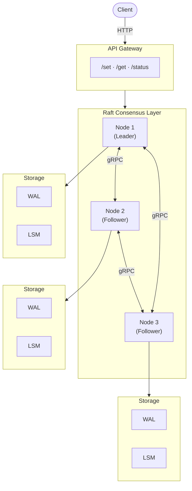
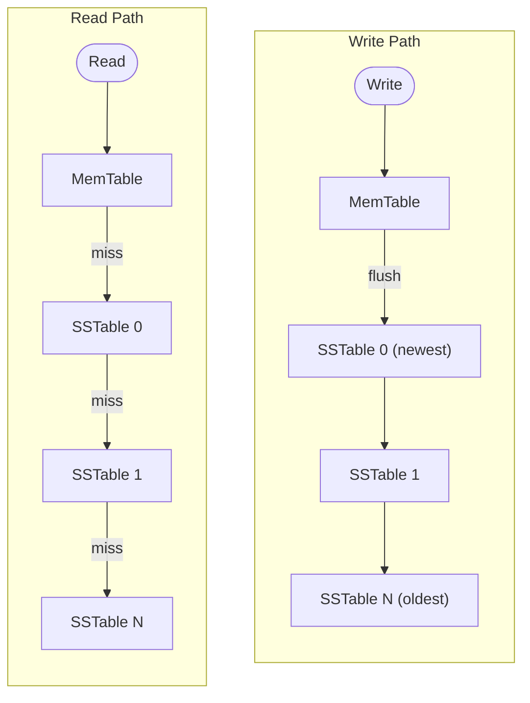

# Golt — Distributed Key-Value Store

A distributed key-value store implementing the [Raft consensus algorithm](https://raft.github.io/raft.pdf) in Go.

## Overview

Golt provides strong consistency guarantees through Raft consensus, making it suitable for coordination services, configuration management, and distributed locking. The system automatically handles leader election, log replication, and failure recovery.

## Architecture



## Core Components

| Component | Description |
|-----------|-------------|
| **Raft Node** | Implements Raft state machine with leader election, log replication |
| **gRPC Server** | Handles inter-node RPC (RequestVote, AppendEntries, InstallSnapshot) |
| **API Gateway** | HTTP REST interface with automatic leader forwarding |
| **WAL** | Write-ahead log for crash recovery |
| **LSM Store** | Log-structured merge-tree with MemTable + SSTables |
| **Snapshot Store** | Periodic state snapshots for log compaction |

## Raft Implementation Details

### Leader Election
- Randomized election timeouts (150-300ms) prevent split votes
- Candidates request votes from all peers in parallel
- Term-based leader detection with automatic step-down

### Log Replication
- Leader appends entries to local log, then replicates to followers
- Entries committed when majority acknowledges
- Automatic log consistency resolution via `nextIndex` decrement

### Snapshotting
- Automatic snapshots when log exceeds threshold
- InstallSnapshot RPC for slow/recovering followers
- Log compaction after successful snapshot

## Benchmark Results

Benchmarks run on a 3-node cluster (localhost, 10 clients, 100 ops/client):

| Metric | Write | Read (Leader) | Read (Follower) |
|--------|-------|---------------|-----------------|
| **Throughput** | ~832 ops/sec | ~18,436 ops/sec | ~16,647 ops/sec |
| **Avg Latency** | — | ~566µs | ~566µs |
| **P50 Latency** | — | ~192µs | ~192µs |
| **P99 Latency** | — | ~10.6ms | ~10.6ms |

> **Note**: Writes require consensus (majority ack), hence lower throughput. Reads are local and significantly faster.

### Running Benchmarks

```bash
go run ./test/benchmark
```

## Test Suite

| Test | Description |
|------|-------------|
| `electionTest` | Verifies leader election with network partitions |
| `logReplication` | Tests log consistency across nodes |
| `snapshotTest` | Validates snapshot creation and restoration |
| `installSnapshotTest` | Tests follower catch-up via snapshot |
| `recoveryTest` | Crash recovery from WAL |
| `chaosTest` | Random node failures and restarts |
| `linearizabilityTest` | Verifies strong consistency guarantees |

```bash
# run all tests
cd test && ./run_all.sh
```

## Storage Engine

### LSM-Tree Architecture



- **MemTable**: In-memory sorted map, flushes at 1000 entries
- **SSTable**: Immutable sorted files with binary search
- **Tombstones**: Deletions tracked until compaction

## Deployment

### Docker Compose (5-node cluster)

```bash
docker compose up --build -d

# verify cluster health
for port in 8001 8002 8003 8004 8005; do
  curl -s localhost:$port/status | jq '{node:.nodeId, state:.state}'
done
```

### Local Development

```bash
# terminal 1
go run ./cmd/golt -id=node1 -address=:7001 -http=:8001 -peers=:7002,:7003

# terminal 2
go run ./cmd/golt -id=node2 -address=:7002 -http=:8002 -peers=:7001,:7003

# terminal 3
go run ./cmd/golt -id=node3 -address=:7003 -http=:8003 -peers=:7001,:7002
```

## Configuration

| Flag | Default | Description |
|------|---------|-------------|
| `-id` | required | Unique node identifier |
| `-address` | required | gRPC listen address |
| `-http` | optional | HTTP API address |
| `-peers` | optional | Comma-separated peer addresses |
| `-data` | `/tmp/golt-<id>` | Data directory |

### Tuning Parameters (compile-time)

| Parameter | Default | Location |
|-----------|---------|----------|
| Election timeout | 150-300ms | `node.go` |
| Heartbeat interval | 50ms | `node.go` |
| MemTable limit | 1000 entries | `lsm.go` |
| Snapshot threshold | 100 entries | `snapshot.go` |

## API Reference

### Set Key
```bash
curl -X POST http://localhost:8001/set \
  -H "Content-Type: application/json" \
  -d '{"key":"name","value":"ameya"}'
```
```json
{"success":true,"index":1}
```

### Get Key
```bash
curl "http://localhost:8001/get?key=name"
```
```json
{"key":"name","value":"ameya","found":true}
```

### Node Status
```bash
curl http://localhost:8001/status
```
```json
{
  "nodeId": "node1",
  "state": "Leader",
  "term": 5,
  "commitIndex": 1,
  "logLength": 1,
  "leader": "node1",
  "isLeader": true
}
```

## Project Structure

```
mygolt/
├── api/gateway.go        # HTTP REST API
├── cmd/golt/main.go      # CLI entry point
├── logger/               # Structured logging
├── proto/                # gRPC/protobuf definitions
├── raft/
│   ├── node.go           # Raft state machine
│   ├── server.go         # gRPC server + peer connections
│   ├── wal.go            # Write-ahead log
│   ├── snapshot.go       # Snapshot management
│   └── timer.go          # Election/heartbeat timer constants
├── storage/
│   ├── lsm.go            # LSM-tree coordinator
│   ├── memtable.go       # In-memory sorted map
│   └── sstable.go        # On-disk sorted string table
└── test/                 # Integration tests + benchmarks
```

## References

- [Raft Paper](https://raft.github.io/raft.pdf) — In Search of an Understandable Consensus Algorithm
- [Raft Visualization](https://thesecretlivesofdata.com/raft/) — Interactive Raft explanation
